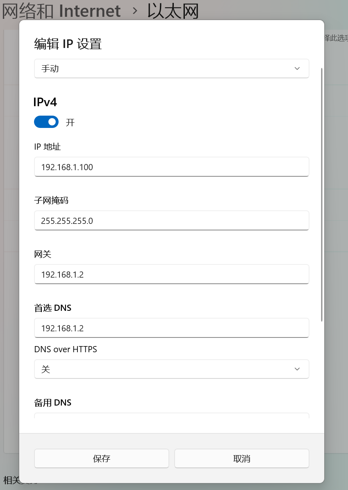

# clash-docker 一键运行clash透明网关

## 写在前面

最近研究了很多软路由，openwrt等方案，其实对于大部分人来说，完全不需要软路由。软路由的核心需求是什么呢？大部分人只是作为一个翻墙工具，如果只是这样的需求，起一个clash容器完全够用。

## 使用教程

你可以直接在当前目录下将docker运行起来：

```bash
docker compose up -d
```

如果有特殊需求，可以更改`config/config.yaml`内容，或者直接替换为你的clash配置文件。

1. 修改订阅地址。

   ```yaml
   proxy-providers:
   speed-cat:
      <<: *p
      # 修改url为你的订阅地址
      url: ""
      path: ./proxy_providers/provider1.yaml
   ```

2. 如果你的设备网卡名称不是`eth0`，则需要修改网卡名称。

   ```yaml
   # 网卡名称
   interface-name: eth0

   # tun 配置
   tun:
     enable: true
     include-interface:
       - eth0
   ```

3. 修改 *网关* 和 *DNS* 为clash所在设备地址。

   

4. dashboard界面，打开<http://192.168.1.2:9090/ui/>，地址替换为clash的ip地址。
   
   显示如下
   
